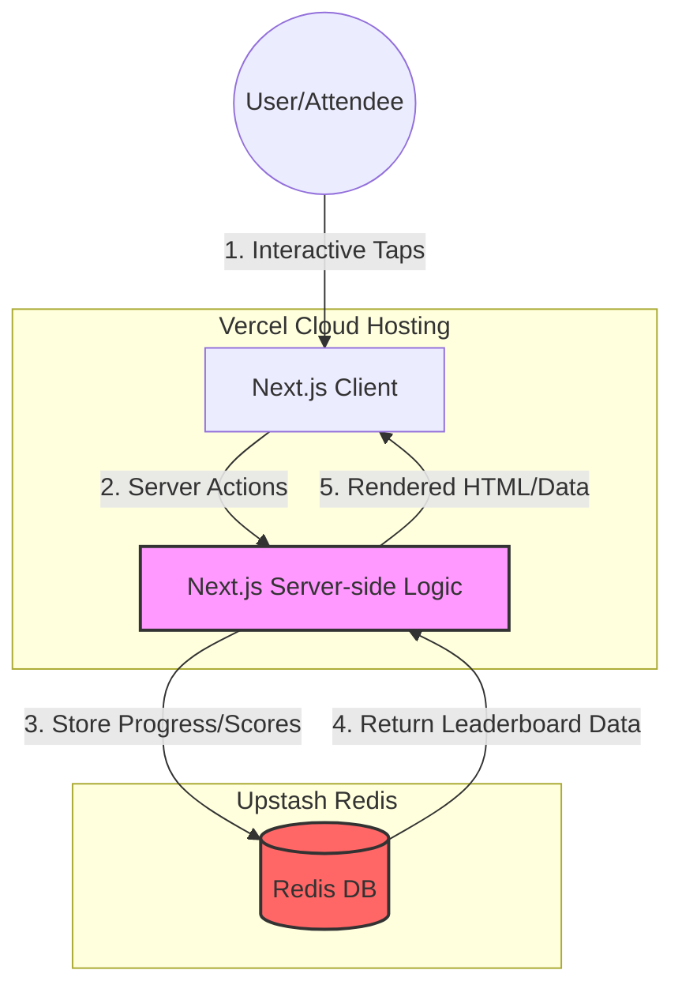

# Bingo Game v.4.0
**An interactive networking tool for the CSUF ECS Diversity and Inclusion Council.**


## Project Objective
Bingo Game v.4.0 is a mobile-responsive web application designed as an ice-breaker game for the 2026 ECS Diversity and Inclusion Council convention. The 5x5 grid features **conversation starters and networking takeaways** to encourage participants to interact with other attendees. 

### Key Features
*   **Interactive Grid:** Tap squares to track networking progress.
*   **Win Logic:** Automatic detection of 5-in-a-row with prize claim instructions.
*   **Persistence:** The game state persists after winning, encouraging continued networking throughout the weekend.
*   **Leaderboard:** Integration with Redis to track top prompts users selected throughout the two-day event in real-time.


Tips for new contributors can be found here: [Project Guide](https://github.com/ECS-Web-Dev/Bingo_Game_v4/blob/main/PROJECT_GUIDE.md)

Testing Plan can be found here: [Test Plan](https://github.com/ECS-Web-Dev/Bingo_Game_v4/blob/main/TEST_PLAN.md) 

## Architecture



## Tech Stack
* Frontend Framework: Next.js (App Router) – Powering the core application logic and server-side rendering.
* Styling: Tailwind CSS – Utilized for a responsive, mobile-first design suitable for convention use.
* State & Persistence: Upstash Redis – Tracks real-time prompt engagement.
* Deployment: Vercel – Provides CI/CD and edge hosting for high availability during events.


## Getting Started
First, clone the repo. Github provides tips for cloning a repository [here](https://docs.github.com/en/repositories/creating-and-managing-repositories/cloning-a-repository)

After you first clone the repo, open a Terminal and install the dependencies:
```bash
npm install
# or
yarn install
# or
pnpm install
# or
bun install
```


This only needs to be done when you first clone the project and when new dependencies are added to the main branch. 

Then, run the development server:

```bash
npm run dev
# or
yarn dev
# or
pnpm dev
# or
bun dev
```

Open [http://localhost:3000](http://localhost:3000) with your browser to see the result.

You can start editing the page by modifying `app/page.js`. The page auto-updates as you edit the file.

## Future Work
These are suggested features for v.5:
1. Move the in-code prompts and Box data model into a database. The db should then seed the Box components with the prompts.

